# 5. Use Case Model

## 5.1 Use Case Diagram

```mermaid
graph TB
    Student[Student] --> UC1[Register/Login]
    Student --> UC2[Create Project]
    Student --> UC3[Submit Project]
    Student --> UC4[Upload Version]
    Student --> UC5[View Evaluation]
    
    Guide[Guide] --> UC6[Review Submission]
    Guide --> UC7[Approve/Reject]
    Guide --> UC8[View Allocated Students]
    
    Coordinator[Coordinator] --> UC9[Allocate Guides]
    Coordinator --> UC10[Override Allocation]
    Coordinator --> UC11[Manage Workflow]
    
    Evaluator[Evaluator] --> UC12[Evaluate Project]
    Evaluator --> UC13[Submit Marks]
    
    Admin[Admin] --> UC14[Manage Users]
    Admin --> UC15[Manage Roles]
```

## 5.2 Use Case Descriptions

### UC-01: Register/Login
- **Actor:** Student, Guide, Coordinator, Evaluator, Admin
- **Precondition:** User has valid credentials
- **Flow:** User enters credentials → System validates → System creates session → User redirected to dashboard
- **Postcondition:** User authenticated

### UC-02: Create Project
- **Actor:** Student
- **Precondition:** Student logged in
- **Flow:** Student enters project details → System validates → System creates project → Student can upload files
- **Postcondition:** Project created in DRAFT state

### UC-03: Submit Project
- **Actor:** Student
- **Precondition:** Project exists with files
- **Flow:** Student clicks submit → System changes status to SUBMITTED → Guide notified
- **Postcondition:** Project in SUBMITTED state

### UC-04: Upload Version
- **Actor:** Student
- **Precondition:** Project exists
- **Flow:** Student uploads new version → System creates immutable version → Version history updated
- **Postcondition:** New version available

### UC-05: Review Submission
- **Actor:** Guide
- **Precondition:** Project submitted to guide
- **Flow:** Guide views submission → Guide approves or rejects → Student notified
- **Postcondition:** Project status updated

### UC-06: Allocate Guides
- **Actor:** Coordinator
- **Precondition:** Students have submitted preferences
- **Flow:** System suggests allocation → Coordinator reviews → Coordinator confirms or overrides
- **Postcondition:** Guides allocated

### UC-07: Evaluate Project
- **Actor:** Evaluator
- **Precondition:** Project approved by guide
- **Flow:** Evaluator views project → Evaluator assigns marks per rubric → System calculates final score
- **Postcondition:** Evaluation complete
