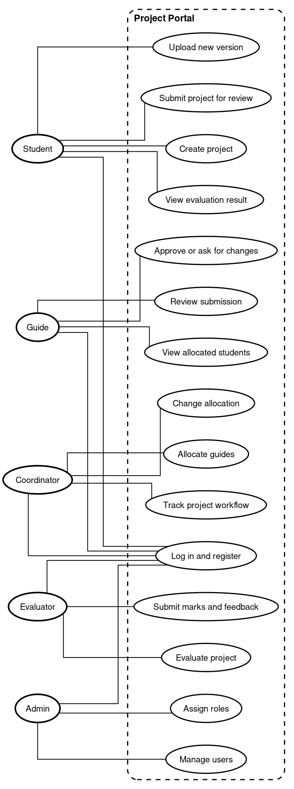

# 5. Use Case Model

## 5.1 Use Case Diagram

Source: [05-use-case.dot](diagrams/05-use-case.dot). Recompile with `dot -Tpng -Gdpi=150 05-use-case.dot -o 05-use-case.png`.

## 5.2 Use Case Descriptions

### UC-01: Register/Login
- **Actor:** Student, Guide, Coordinator, Evaluator, Admin
- **Precondition:** User has valid credentials
- **Flow:** User enters credentials, system validates, system creates session, user lands on dashboard
- **Postcondition:** User authenticated

### UC-02: Create Project
- **Actor:** Student
- **Precondition:** Student logged in
- **Flow:** Student enters project details, system validates, system creates project, student can upload files
- **Postcondition:** Project created in Draft state

### UC-03: Submit Project
- **Actor:** Student
- **Precondition:** Project exists with files
- **Flow:** Student clicks submit, system changes status to Submitted, guide notified
- **Postcondition:** Project in Submitted state

### UC-04: Upload Version
- **Actor:** Student
- **Precondition:** Project exists
- **Flow:** Student uploads new version, system creates immutable version, version history updated
- **Postcondition:** New version available

### UC-05: Review Submission
- **Actor:** Guide
- **Precondition:** Project submitted to guide
- **Flow:** Guide views submission, guide approves or rejects, student notified
- **Postcondition:** Project status updated

### UC-06: Allocate Guides
- **Actor:** Coordinator
- **Precondition:** Students have submitted preferences
- **Flow:** System suggests allocation, coordinator reviews, coordinator confirms or overrides
- **Postcondition:** Guides allocated

### UC-07: Evaluate Project
- **Actor:** Evaluator
- **Precondition:** Project approved by guide
- **Flow:** Evaluator views project, evaluator assigns marks per rubric, system calculates final score
- **Postcondition:** Evaluation complete

### UC-08: Track Project Workflow
- **Actor:** Coordinator
- **Precondition:** Coordinator logged in
- **Flow:** Coordinator opens workflow view, system shows counts by status, coordinator follows up on stuck projects
- **Postcondition:** Coordinator has full status picture

### UC-09: Assign Roles
- **Actor:** Admin
- **Precondition:** Admin logged in
- **Flow:** Admin opens user list, admin changes a user role, system applies new permissions on next login
- **Postcondition:** User role updated

### UC-10: Submit Synopsis
- **Actor:** Student
- **Precondition:** Student logged in, deadline window open
- **Flow:** Student writes title and summary, student submits, mentor gets notified
- **Postcondition:** Synopsis in Submitted state

### UC-11: Approve Synopsis
- **Actor:** Guide
- **Precondition:** Synopsis submitted to guide
- **Flow:** Guide accepts and the full project opens, or guide returns it with comments
- **Postcondition:** Synopsis approved or returned

### UC-12: Set Deadlines
- **Actor:** Batch Mentor
- **Precondition:** Batch mentor logged in
- **Flow:** Mentor sets open and close dates per project type, system blocks late uploads
- **Postcondition:** Deadline window active

### UC-13: Offer and Book Review Slots
- **Actor:** Guide, Student
- **Precondition:** Guide published slots
- **Flow:** Student books a free slot, both sides get an in app reminder
- **Postcondition:** Slot booked

### UC-14: Link Repo and View Analysis
- **Actor:** Student
- **Precondition:** Project exists
- **Flow:** Student links GitHub repo, system syncs commits and computes the parameter report
- **Postcondition:** Analysis visible to student and mentor

### UC-15: Edit Rubric
- **Actor:** Batch Mentor
- **Precondition:** Batch mentor logged in
- **Flow:** Mentor adjusts criteria for the batch, new evaluations use the updated rubric
- **Postcondition:** Rubric updated

### UC-16: Browse Project Showcase
- **Actor:** Guest, Student
- **Precondition:** None
- **Flow:** Visitor opens the gallery, system lists evaluated projects
- **Postcondition:** Public list viewed
