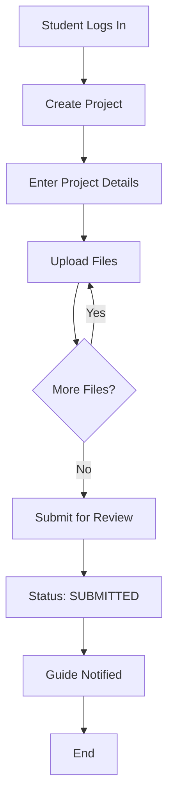
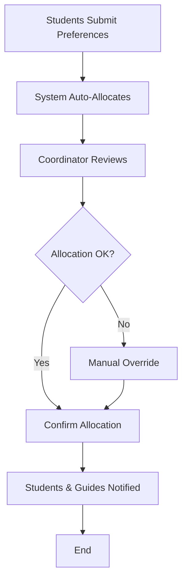
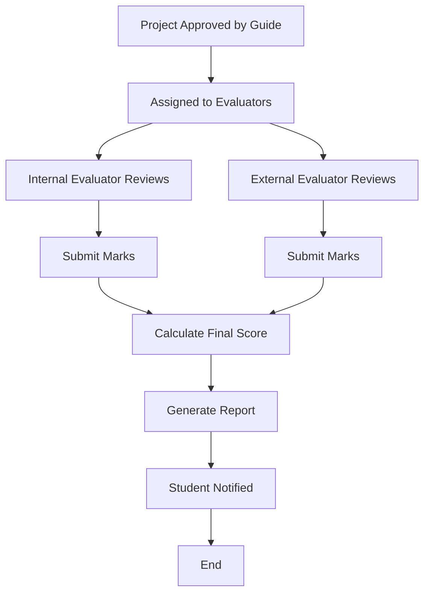

# 6. Activity Diagrams

## 6.1 Project Submission Flow

```mermaid
flowchart TD
    A[Student Logs In] --> B[Create Project]
    B --> C[Enter Project Details]
    C --> D[Upload Files]
    D --> E{More Files?}
    E -->|Yes| D
    E -->|No| F[Submit for Review]
    F --> G[Status: SUBMITTED]
    G --> H[Guide Notified]
    H --> I[End]
```

## 6.2 Guide Allocation Flow

```mermaid
flowchart TD
    A[Students Submit Preferences] --> B[System Auto-Allocates]
    B --> C[Coordinator Reviews]
    C --> D{Allocation OK?}
    D -->|Yes| E[Confirm Allocation]
    D -->|No| F[Manual Override]
    F --> E
    E --> G[Students & Guides Notified]
    G --> H[End]
```

## 6.3 Evaluation Flow

```mermaid
flowchart TD
    A[Project Approved by Guide] --> B[Assigned to Evaluators]
    B --> C[Internal Evaluator Reviews]
    B --> D[External Evaluator Reviews]
    C --> E[Submit Marks]
    D --> F[Submit Marks]
    E --> G[Calculate Final Score]
    F --> G
    G --> H[Generate Report]
    H --> I[Student Notified]
    I --> J[End]
```
