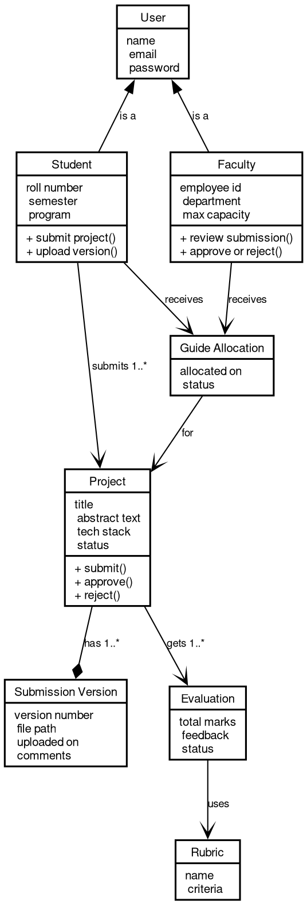

# 7. Class Diagram

## 7.1 Domain Model

Source: [07-class.dot](diagrams/07-class.dot). Recompile with `dot -Tpng -Gdpi=150 07-class.dot -o 07-class.png`.

This model maps one to one to the backend entities in `backend/src/main/java/com/iips/pms/entity/`.

## 7.2 Design Decisions

- **User hierarchy:** Single table inheritance with role discriminator
- **Version control:** Immutable versions with metadata
- **Audit trail:** createdAt, updatedAt on all entities
- **Soft delete:** deletedAt field for data retention
