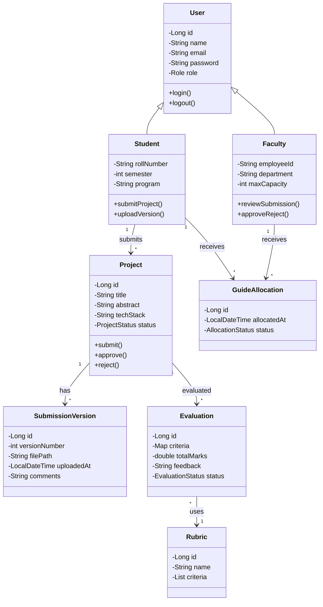

# 7. Class Diagram

## 7.1 Domain Model

## 7.2 Design Decisions

- **User hierarchy:** Single table inheritance with role discriminator
- **Version control:** Immutable versions with metadata
- **Audit trail:** createdAt, updatedAt on all entities
- **Soft delete:** deletedAt field for data retention
