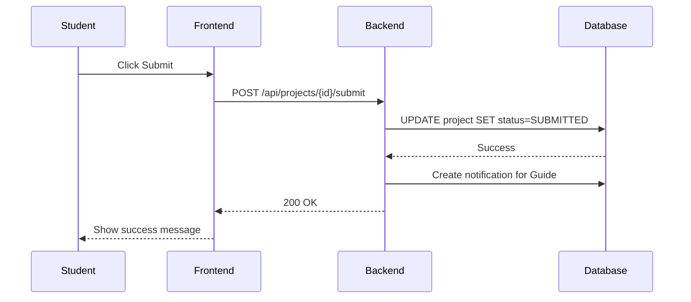
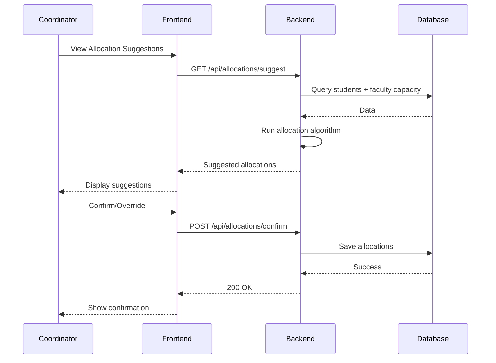
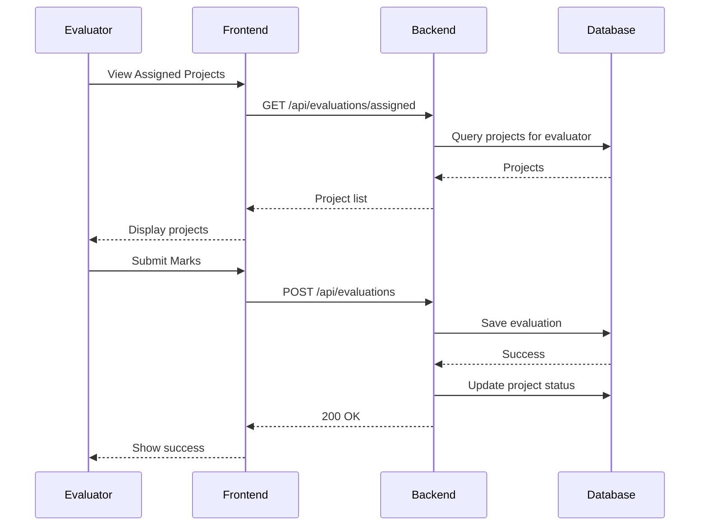

# 9. Sequence Diagrams

## 9.1 Project Submission

```mermaid
sequenceDiagram
    participant S as Student
    participant FE as Frontend
    participant BE as Backend
    participant DB as Database
    
    S->>FE: Click Submit
    FE->>BE: POST /api/projects/{id}/submit
    BE->>DB: UPDATE project SET status=SUBMITTED
    DB-->>BE: Success
    BE->>DB: Create notification for Guide
    BE-->>FE: 200 OK
    FE-->>S: Show success message
```

## 9.2 Guide Allocation

```mermaid
sequenceDiagram
    participant C as Coordinator
    participant FE as Frontend
    participant BE as Backend
    participant DB as Database
    
    C->>FE: View Allocation Suggestions
    FE->>BE: GET /api/allocations/suggest
    BE->>DB: Query students + faculty capacity
    DB-->>BE: Data
    BE->>BE: Run allocation algorithm
    BE-->>FE: Suggested allocations
    FE-->>C: Display suggestions
    
    C->>FE: Confirm/Override
    FE->>BE: POST /api/allocations/confirm
    BE->>DB: Save allocations
    DB-->>BE: Success
    BE-->>FE: 200 OK
    FE-->>C: Show confirmation
```

## 9.3 Evaluation

```mermaid
sequenceDiagram
    participant E as Evaluator
    participant FE as Frontend
    participant BE as Backend
    participant DB as Database
    
    E->>FE: View Assigned Projects
    FE->>BE: GET /api/evaluations/assigned
    BE->>DB: Query projects for evaluator
    DB-->>BE: Projects
    BE-->>FE: Project list
    FE-->>E: Display projects
    
    E->>FE: Submit Marks
    FE->>BE: POST /api/evaluations
    BE->>DB: Save evaluation
    DB-->>BE: Success
    BE->>DB: Update project status
    BE-->>FE: 200 OK
    FE-->>E: Show success
```
