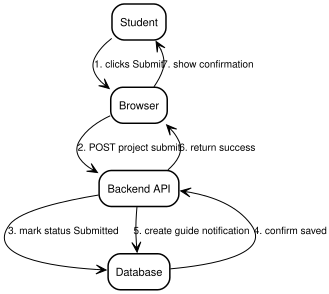
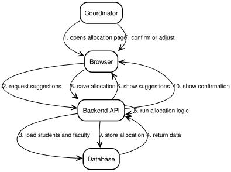
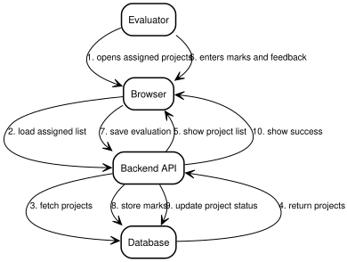

# 9. Sequence Diagrams

Interaction steps are numbered in call order. Each step names the caller, the action, and the receiver in plain words.

## 9.1 Project Submission

Source: [09-sequence-submission.dot](diagrams/09-sequence-submission.dot).

Mirrors `POST /api/v1/projects/{id}/submit` in `ProjectController`.

## 9.2 Guide Allocation

Source: [09-sequence-allocation.dot](diagrams/09-sequence-allocation.dot).

## 9.3 Evaluation

Source: [09-sequence-evaluation.dot](diagrams/09-sequence-evaluation.dot).
