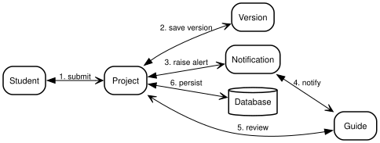
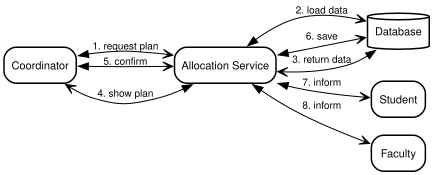
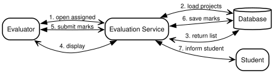

# 10. Communication Diagrams

Each link is numbered in call order and names the two collaborators plus the message between them.

## 10.1 Project Submission (Collaboration)

Source: [10-comm-submission.dot](diagrams/10-comm-submission.dot).

## 10.2 Guide Allocation (Collaboration)

Source: [10-comm-allocation.dot](diagrams/10-comm-allocation.dot).

## 10.3 Evaluation (Collaboration)

Source: [10-comm-evaluation.dot](diagrams/10-comm-evaluation.dot).
