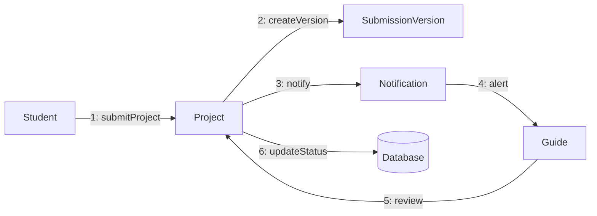
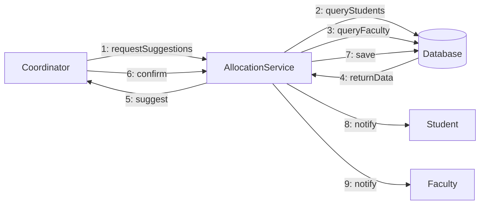
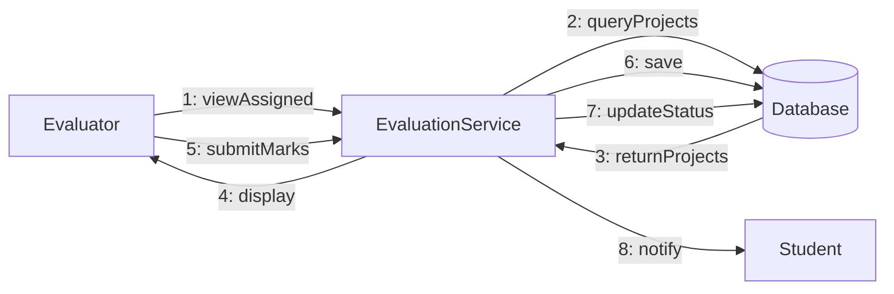

# 10. Communication Diagrams

## 10.1 Project Submission (Collaboration)

```mermaid
graph LR
    S[Student] -->|1: submitProject| P[Project]
    P -->|2: createVersion| V[SubmissionVersion]
    P -->|3: notify| N[Notification]
    N -->|4: alert| G[Guide]
    G -->|5: review| P
    P -->|6: updateStatus| DB[(Database)]
```

## 10.2 Guide Allocation (Collaboration)

```mermaid
graph LR
    C[Coordinator] -->|1: requestSuggestions| A[AllocationService]
    A -->|2: queryStudents| DB[(Database)]
    A -->|3: queryFaculty| DB
    DB -->|4: returnData| A
    A -->|5: suggest| C
    C -->|6: confirm| A
    A -->|7: save| DB
    A -->|8: notify| S[Student]
    A -->|9: notify| F[Faculty]
```

## 10.3 Evaluation (Collaboration)

```mermaid
graph LR
    E[Evaluator] -->|1: viewAssigned| Ev[EvaluationService]
    Ev -->|2: queryProjects| DB[(Database)]
    DB -->|3: returnProjects| Ev
    Ev -->|4: display| E
    E -->|5: submitMarks| Ev
    Ev -->|6: save| DB
    Ev -->|7: updateStatus| DB
    Ev -->|8: notify| S[Student]
```
