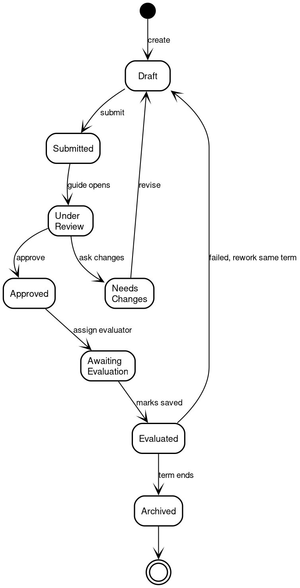
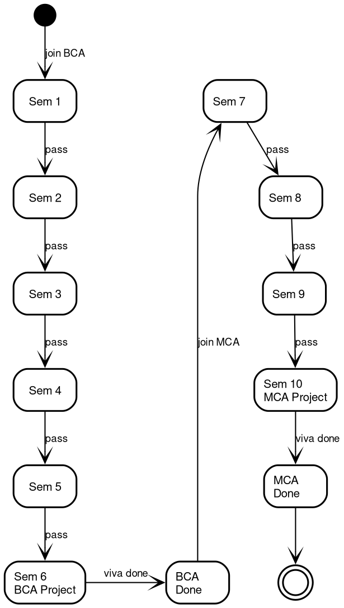
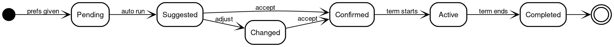
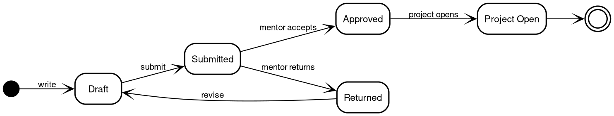

# 11. State Machine Diagrams

## 11.1 Project Lifecycle

Source: [11-state-project.dot](diagrams/11-state-project.dot).

States: Draft, Submitted, Under Review, Approved, Needs Changes, Awaiting Evaluation, Evaluated, Archived. A failed evaluation returns the project to Draft for rework in the same semester.

## 11.2 Student Record Lifecycle (Sem 1-10)

Source: [11-state-student.dot](diagrams/11-state-student.dot).

BCA semesters 1 to 5 build the profile. Semester 6 carries the BCA final project and viva. MCA semesters 7 to 9 build the profile again. Semester 10 carries the MCA final project and viva.

## 11.3 Guide Allocation States

Source: [11-state-allocation.dot](diagrams/11-state-allocation.dot).

States: Pending, Suggested, Confirmed, Changed, Active, Completed.

## 11.4 Synopsis Lifecycle

Source: [11-state-synopsis.dot](diagrams/11-state-synopsis.dot).

States: Draft, Submitted, Approved, Returned. An approved synopsis opens the full project for versions. A returned synopsis goes back to Draft for revision.
