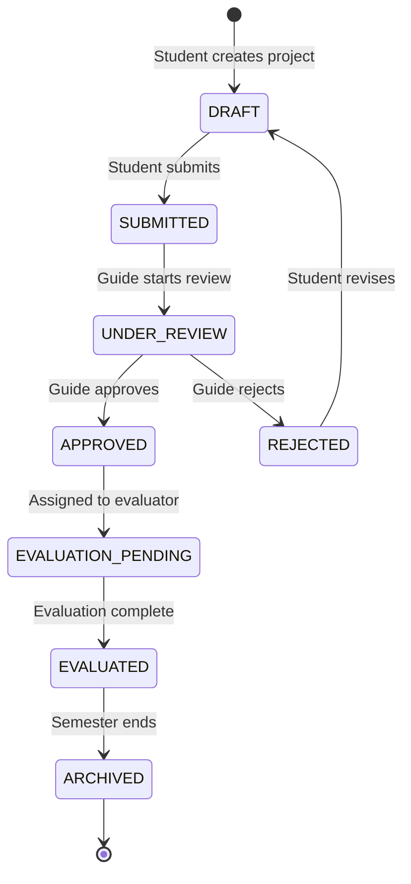
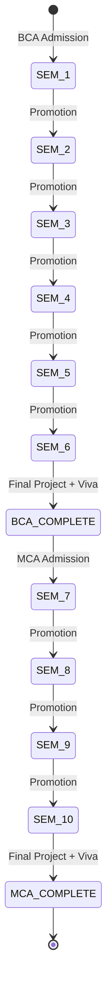
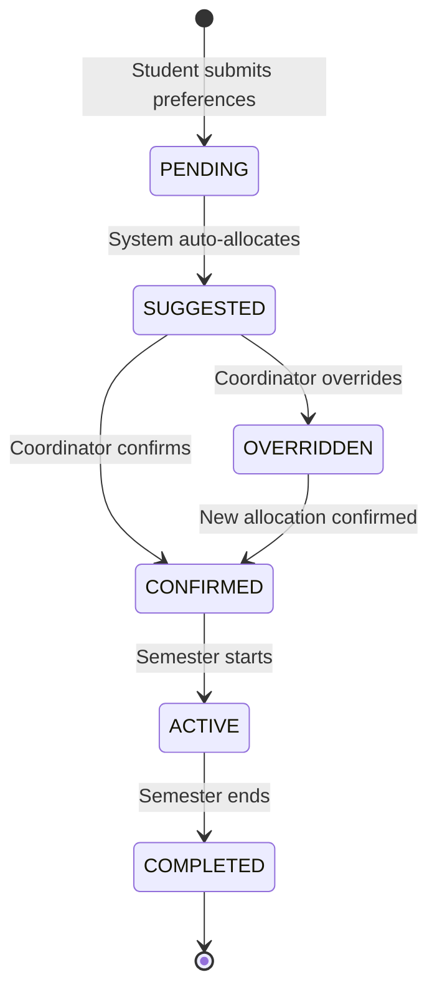

# 11. State Machine Diagrams

## 11.1 Project Lifecycle

```mermaid
stateDiagram-v2
    [*] --> DRAFT : Student creates project
    DRAFT --> SUBMITTED : Student submits
    SUBMITTED --> UNDER_REVIEW : Guide starts review
    UNDER_REVIEW --> APPROVED : Guide approves
    UNDER_REVIEW --> REJECTED : Guide rejects
    REJECTED --> DRAFT : Student revises
    APPROVED --> EVALUATION_PENDING : Assigned to evaluator
    EVALUATION_PENDING --> EVALUATED : Evaluation complete
    EVALUATED --> ARCHIVED : Semester ends
    ARCHIVED --> [*]
```

## 11.2 Student Record Lifecycle (Sem 1-10)

```mermaid
stateDiagram-v2
    [*] --> SEM_1 : BCA Admission
    SEM_1 --> SEM_2 : Promotion
    SEM_2 --> SEM_3 : Promotion
    SEM_3 --> SEM_4 : Promotion
    SEM_4 --> SEM_5 : Promotion
    SEM_5 --> SEM_6 : Promotion
    SEM_6 --> BCA_COMPLETE : Final Project + Viva
    BCA_COMPLETE --> SEM_7 : MCA Admission
    SEM_7 --> SEM_8 : Promotion
    SEM_8 --> SEM_9 : Promotion
    SEM_9 --> SEM_10 : Promotion
    SEM_10 --> MCA_COMPLETE : Final Project + Viva
    MCA_COMPLETE --> [*]
```

## 11.3 Guide Allocation States

```mermaid
stateDiagram-v2
    [*] --> PENDING : Student submits preferences
    PENDING --> SUGGESTED : System auto-allocates
    SUGGESTED --> CONFIRMED : Coordinator confirms
    SUGGESTED --> OVERRIDDEN : Coordinator overrides
    OVERRIDDEN --> CONFIRMED : New allocation confirmed
    CONFIRMED --> ACTIVE : Semester starts
    ACTIVE --> COMPLETED : Semester ends
    COMPLETED --> [*]
```
