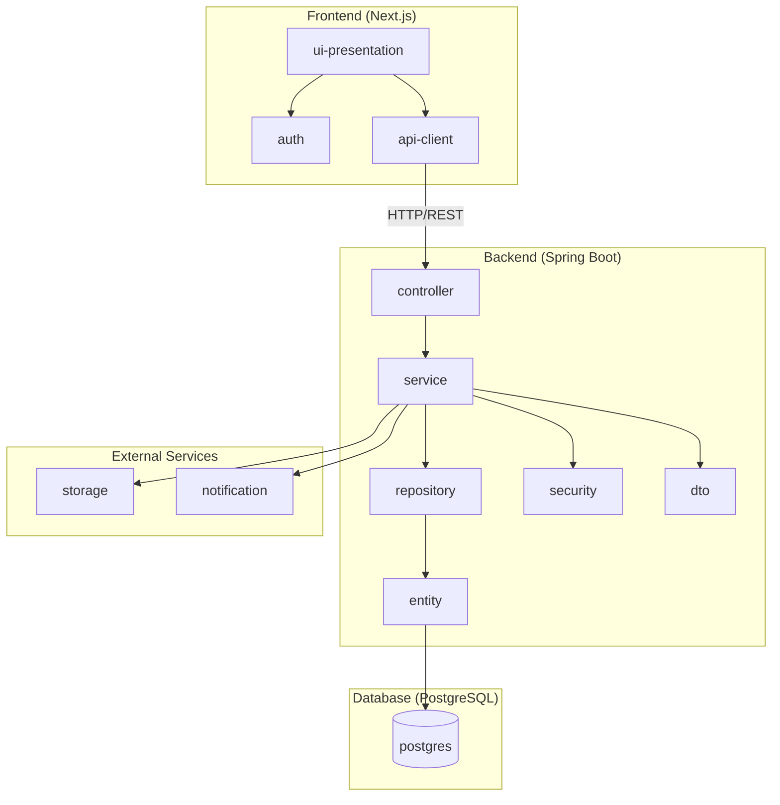

# 12. Package Diagram

## 12.1 System Packages



## 12.2 Backend Package Structure

```
com.iips.pms
├── controller/     # REST endpoints
├── service/        # Business logic
├── repository/     # Data access
├── entity/         # JPA entities
├── dto/            # Data transfer objects
├── security/       # JWT, RBAC
├── config/         # Spring config
├── exception/      # Custom exceptions
└── util/           # Utilities
```

## 12.3 Frontend Package Structure

```
frontend/
├── app/            # Next.js App Router
│   ├── (auth)/     # Login, register
│   ├── (dashboard)/ # Role-based dashboards
│   └── api/        # API routes (proxy)
├── components/     # React components
│   ├── ui/         # shadcn/ui
│   └── features/   # Feature components
├── lib/            # Utilities, API client
└── types/          # TypeScript types
```
