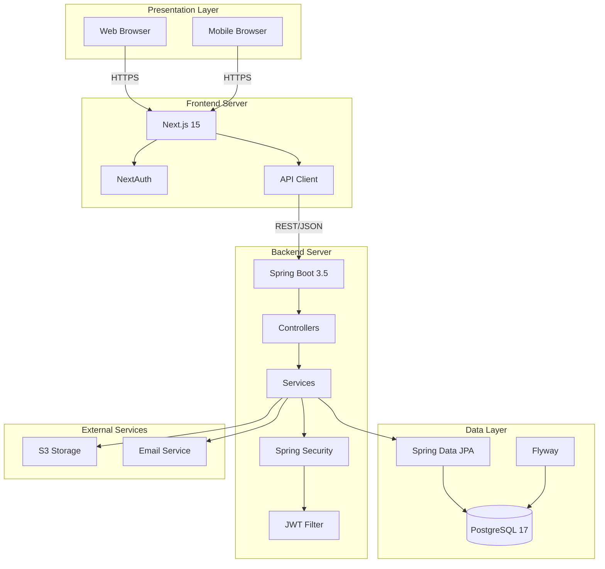

# 13. Component Diagram

## 13.1 System Components

## 13.2 Component Interfaces

| Component | Interface | Protocol |
|-----------|-----------|----------|
| Web Browser | HTTP/HTTPS | REST |
| Next.js | Internal | React Server Components |
| API Client | HTTP/JSON | REST |
| Spring Boot | Internal | Spring DI |
| JPA | JDBC | SQL |
| Flyway | JDBC | SQL |
| S3 | HTTP | S3 API |
| Email | SMTP | SMTP |
