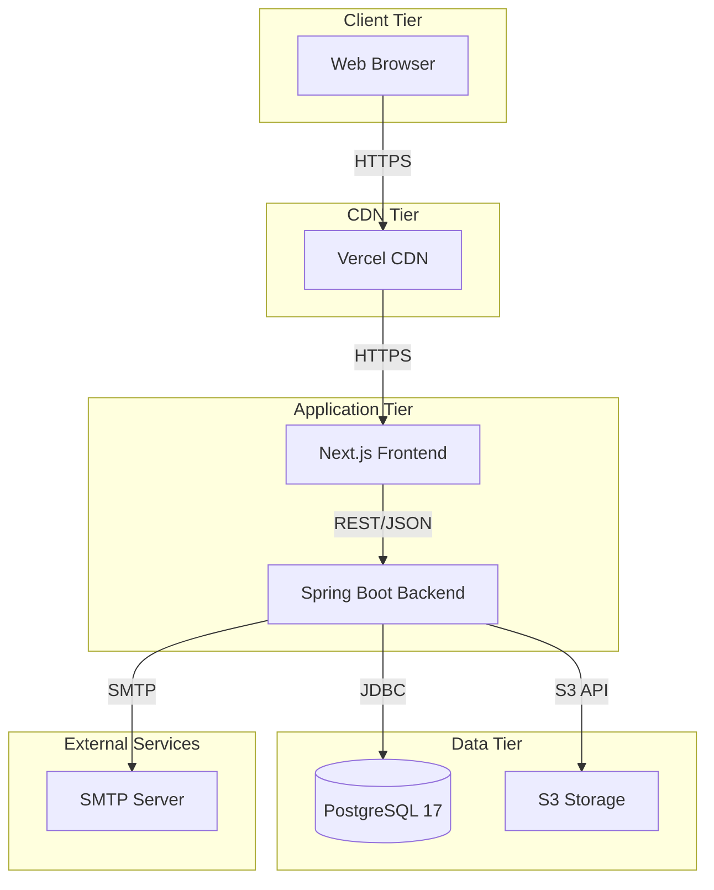
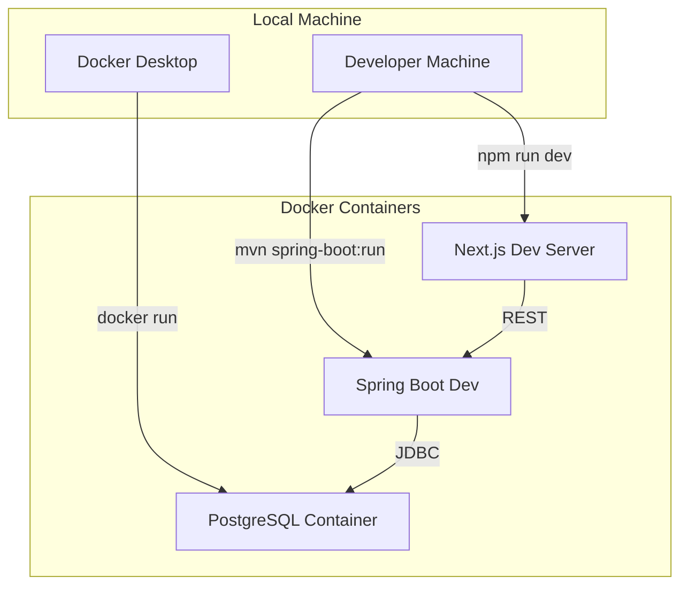

# 14. Deployment Diagram

## 14.1 Production Deployment

## 14.2 Development Deployment

## 14.3 Deployment Environments

| Environment | Frontend | Backend | Database |
|-------------|----------|---------|----------|
| Development | localhost:3000 | localhost:8080 | localhost:5432 |
| Staging | staging.iips-pms.com | api-staging.iips-pms.com | staging-db |
| Production | iips-pms.com | api.iips-pms.com | prod-db |
