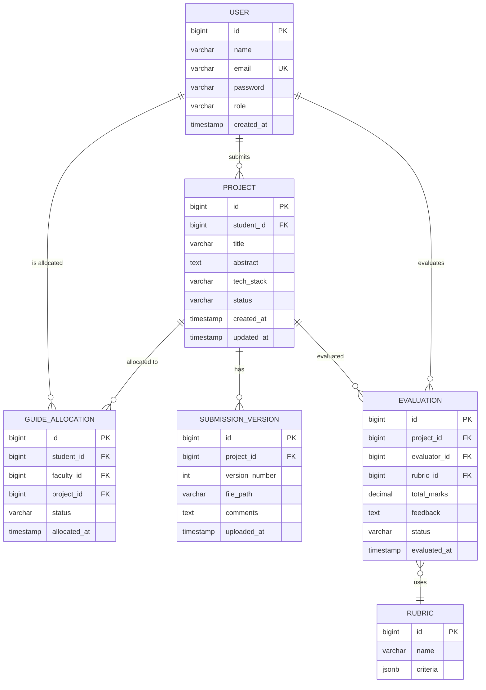

# 15. Database Design

## 15.1 ER Diagram



## 15.2 Relational Schema

### users
| Column | Type | Constraints |
|--------|------|-------------|
| id | BIGSERIAL | PK |
| name | VARCHAR(100) | NOT NULL |
| email | VARCHAR(255) | UNIQUE, NOT NULL |
| password | VARCHAR(255) | NOT NULL |
| role | VARCHAR(20) | NOT NULL, CHECK |
| created_at | TIMESTAMP | DEFAULT NOW() |

### projects
| Column | Type | Constraints |
|--------|------|-------------|
| id | BIGSERIAL | PK |
| student_id | BIGINT | FK → users(id) |
| title | VARCHAR(255) | NOT NULL |
| abstract | TEXT | |
| tech_stack | VARCHAR(500) | |
| status | VARCHAR(20) | DEFAULT 'DRAFT' |
| created_at | TIMESTAMP | DEFAULT NOW() |
| updated_at | TIMESTAMP | DEFAULT NOW() |

### submission_versions
| Column | Type | Constraints |
|--------|------|-------------|
| id | BIGSERIAL | PK |
| project_id | BIGINT | FK → projects(id) |
| version_number | INTEGER | NOT NULL |
| file_path | VARCHAR(500) | NOT NULL |
| comments | TEXT | |
| uploaded_at | TIMESTAMP | DEFAULT NOW() |

### guide_allocations
| Column | Type | Constraints |
|--------|------|-------------|
| id | BIGSERIAL | PK |
| student_id | BIGINT | FK → users(id) |
| faculty_id | BIGINT | FK → users(id) |
| project_id | BIGINT | FK → projects(id) |
| status | VARCHAR(20) | DEFAULT 'PENDING' |
| allocated_at | TIMESTAMP | DEFAULT NOW() |

### evaluations
| Column | Type | Constraints |
|--------|------|-------------|
| id | BIGSERIAL | PK |
| project_id | BIGINT | FK → projects(id) |
| evaluator_id | BIGINT | FK → users(id) |
| rubric_id | BIGINT | FK → rubrics(id) |
| total_marks | DECIMAL(5,2) | |
| feedback | TEXT | |
| status | VARCHAR(20) | DEFAULT 'PENDING' |
| evaluated_at | TIMESTAMP | |

### rubrics
| Column | Type | Constraints |
|--------|------|-------------|
| id | BIGSERIAL | PK |
| name | VARCHAR(100) | NOT NULL |
| criteria | JSONB | NOT NULL |

## 15.3 Indexes

```sql
CREATE INDEX idx_projects_student ON projects(student_id);
CREATE INDEX idx_versions_project ON submission_versions(project_id);
CREATE INDEX idx_allocations_faculty ON guide_allocations(faculty_id);
CREATE INDEX idx_evaluations_project ON evaluations(project_id);
CREATE INDEX idx_users_email ON users(email);
```
