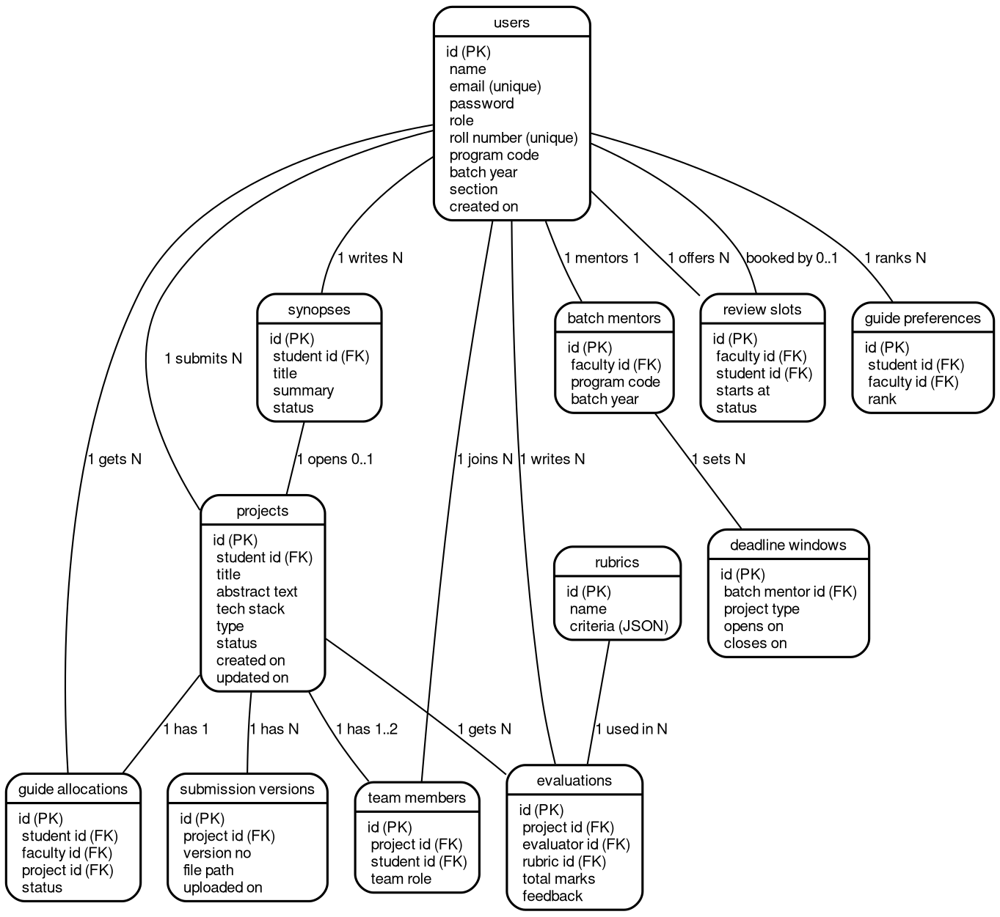

# 15. Database Design

## 15.1 ER Diagram



Source: [15-er.dot](diagrams/15-er.dot). Recompile with `dot -Tpng -Gdpi=150 15-er.dot -o 15-er.png`.

## 15.2 Relational Schema

### users
| Column | Type | Constraints |
|--------|------|-------------|
| id | BIGSERIAL | PK |
| name | VARCHAR(100) | NOT NULL |
| email | VARCHAR(255) | UNIQUE, NOT NULL |
| password | VARCHAR(255) | NOT NULL |
| role | VARCHAR(20) | NOT NULL, discriminator |
| roll_number | VARCHAR(50) | UNIQUE, students only, pattern IC2kYY-NN |
| program_code | VARCHAR(10) | Students only, IC for now |
| batch_year | INTEGER | Students only, admission year |
| section | CHAR(1) | Students only, A or B from first name |
| created_at | TIMESTAMP | DEFAULT NOW() |

### projects
| Column | Type | Constraints |
|--------|------|-------------|
| id | BIGSERIAL | PK |
| student_id | BIGINT | FK → users(id) |
| title | VARCHAR(255) | NOT NULL |
| abstract_text | TEXT | |
| tech_stack | VARCHAR(500) | |
| type | VARCHAR(10) | NOT NULL, MINOR in sem 6, MAJOR in sem 10 |
| status | VARCHAR(20) | DEFAULT 'DRAFT' |
| created_at | TIMESTAMP | DEFAULT NOW() |
| updated_at | TIMESTAMP | DEFAULT NOW() |

### submission_versions
| Column | Type | Constraints |
|--------|------|-------------|
| id | BIGSERIAL | PK |
| project_id | BIGINT | FK → projects(id) |
| version_number | INTEGER | NOT NULL |
| file_path | VARCHAR(500) | NOT NULL |
| comments | TEXT | |
| uploaded_at | TIMESTAMP | DEFAULT NOW() |

### guide_allocations
| Column | Type | Constraints |
|--------|------|-------------|
| id | BIGSERIAL | PK |
| student_id | BIGINT | FK → users(id) |
| faculty_id | BIGINT | FK → users(id) |
| project_id | BIGINT | FK → projects(id) |
| status | VARCHAR(20) | DEFAULT 'PENDING' |
| allocated_at | TIMESTAMP | DEFAULT NOW() |

### evaluations
| Column | Type | Constraints |
|--------|------|-------------|
| id | BIGSERIAL | PK |
| project_id | BIGINT | FK → projects(id) |
| evaluator_id | BIGINT | FK → users(id) |
| rubric_id | BIGINT | FK → rubrics(id) |
| total_marks | DECIMAL(5,2) | |
| feedback | TEXT | |
| status | VARCHAR(20) | DEFAULT 'PENDING' |
| evaluated_at | TIMESTAMP | |

### rubrics
| Column | Type | Constraints |
|--------|------|-------------|
| id | BIGSERIAL | PK |
| name | VARCHAR(100) | NOT NULL |
| criteria | JSONB | NOT NULL |

### batch_mentors (designed, migration pending)
| Column | Type | Constraints |
|--------|------|-------------|
| id | BIGSERIAL | PK |
| faculty_id | BIGINT | FK → users(id), UNIQUE, one batch per mentor |
| program_code | VARCHAR(10) | NOT NULL |
| batch_year | INTEGER | NOT NULL, UNIQUE with program_code |

### synopses (designed, migration pending)
| Column | Type | Constraints |
|--------|------|-------------|
| id | BIGSERIAL | PK |
| student_id | BIGINT | FK → users(id) |
| title | VARCHAR(255) | NOT NULL |
| summary | TEXT | NOT NULL |
| status | VARCHAR(20) | DEFAULT 'DRAFT' |

### deadline_windows (designed, migration pending)
| Column | Type | Constraints |
|--------|------|-------------|
| id | BIGSERIAL | PK |
| batch_mentor_id | BIGINT | FK → batch_mentors(id) |
| project_type | VARCHAR(10) | NOT NULL, MINOR or MAJOR |
| opens_on | TIMESTAMP | NOT NULL |
| closes_on | TIMESTAMP | NOT NULL |

### review_slots (designed, migration pending)| Column | Type | Constraints |
|--------|------|-------------|
| id | BIGSERIAL | PK |
| faculty_id | BIGINT | FK → users(id) |
| student_id | BIGINT | FK → users(id), NULL until booked |
| starts_at | TIMESTAMP | NOT NULL |
| status | VARCHAR(20) | DEFAULT 'OPEN' |

### guide_preferences
| Column | Type | Constraints |
|--------|------|-------------|
| id | BIGSERIAL | PK |
| student_id | BIGINT | FK → users(id) |
| faculty_id | BIGINT | FK → users(id) |
| rank | INTEGER | NOT NULL |

### team_members
| Column | Type | Constraints |
|--------|------|-------------|
| id | BIGSERIAL | PK |
| project_id | BIGINT | FK → projects(id) |
| student_id | BIGINT | FK → users(id) |
| team_role | VARCHAR(20) | LEAD, DEVELOPER, or TESTER |

### code_reviews
| Column | Type | Constraints |
|--------|------|-------------|
| id | BIGSERIAL | PK |
| project_id | BIGINT | FK → projects(id) |
| reviewer_id | BIGINT | FK → users(id) |
| status | VARCHAR(20) | PENDING, CHANGES_REQUESTED, or APPROVED |
| comments | TEXT | |
| created_at | TIMESTAMP | DEFAULT NOW() |

### linked_repositories
| Column | Type | Constraints |
|--------|------|-------------|
| id | BIGSERIAL | PK |
| project_id | BIGINT | FK → projects(id), UNIQUE |
| repo_url | VARCHAR(500) | NOT NULL |
| repo_owner | VARCHAR(255) | NOT NULL |
| repo_name | VARCHAR(255) | NOT NULL |
| verified | BOOLEAN | DEFAULT FALSE |
| last_synced_at | TIMESTAMP | |

### commit_records
| Column | Type | Constraints |
|--------|------|-------------|
| id | BIGSERIAL | PK |
| project_id | BIGINT | FK → projects(id) |
| sha | VARCHAR(64) | UNIQUE, NOT NULL |
| message | TEXT | |
| author | VARCHAR(255) | |
| committed_at | TIMESTAMP | |

### wiki_pages
| Column | Type | Constraints |
|--------|------|-------------|
| id | BIGSERIAL | PK |
| project_id | BIGINT | FK → projects(id) |
| title | VARCHAR(255) | NOT NULL, unique per project |
| body | TEXT | NOT NULL |
| updated_at | TIMESTAMP | |

### notifications
| Column | Type | Constraints |
|--------|------|-------------|
| id | BIGSERIAL | PK |
| recipient_id | BIGINT | FK → users(id) |
| message | TEXT | NOT NULL |
| read | BOOLEAN | DEFAULT FALSE |
| project_id | BIGINT | FK → projects(id) |
| project_status | VARCHAR(30) | |
| created_at | TIMESTAMP | DEFAULT NOW() |

## 15.3 Indexes

```sql
CREATE INDEX idx_projects_student ON projects(student_id);
CREATE INDEX idx_versions_project ON submission_versions(project_id);
CREATE INDEX idx_allocations_faculty ON guide_allocations(faculty_id);
CREATE INDEX idx_evaluations_project ON evaluations(project_id);
CREATE INDEX idx_users_email ON users(email);
```
